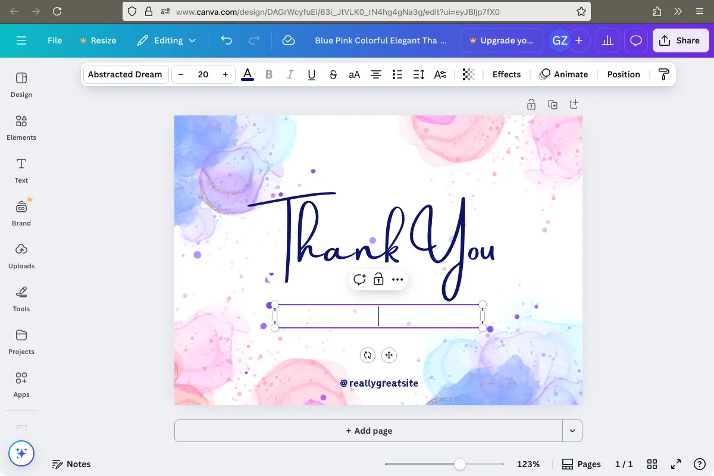
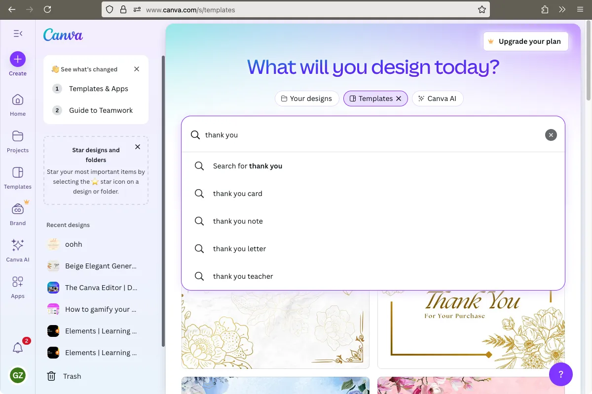
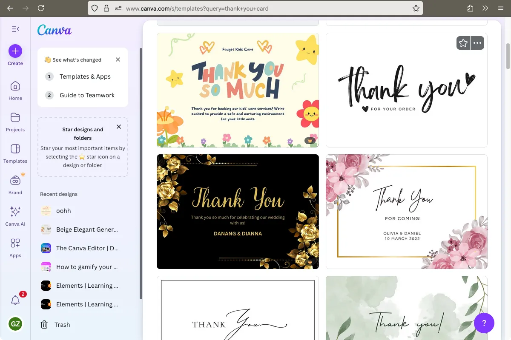

---
**title:** "Design with Canva"  
**slug:** "canva-design"  
**language:** "en"  
**order: 1  
**skills:**  
- design  

**prerequisites:**  
- account-signup

**resources:**
- name: Canva.com  
  website: https://www.canva.com/  
  description: Canva is a free online design tool that lets you create posters, cards, and other graphics easily.
  sign_in_needed: true  
  sign_in_type: "Google/Email"  
  sign_in_link: https://www.canva.com/login/  
  notes: "Canva is free to use for a wide range of designs. "  

**intro:**  
In this topic, learners are introduced to programming logic using Blockly's maze puzzles.
They’ll practice sequencing, loops, and debugging by solving increasingly complex mazes.

**teacher_notes:**    
- Ensure learners understand the block types.
- Use a projector to demonstrate Level 1 and Level 5.
- Allow learners to retry if they fail. Encourage exploration.
---

## Lesson: Design a Thank you card

**Slug:** thank-you-card  
**Duration:** 30 to 60 minutes  
**URL:** https://www.canva.com/login  

**Intro:**
In this lesson you will learn how to create a Thank you card with Canva. Canva is a free online design tool that can be used to make many different designs, birthday cards, posters or brochures.
Think of a real person who has helped you recently and design the card just for them.

**Content:**
1. Login with an account
    - Go to canva.com and sign up for an account or login. [Tip: If you have a Google account, you can use this to quickly sign up to Canva.]
2. Find a template to use
    - In the search bar, type "thank you card"
    - Choose a design you like and choose to customize the template. [Tip: Some templates, marked with a crown, are only available to paid subscribers. Stick to the free ones for this activity.]
3. Make some changes to the card:
    - Click on the different elements.
    - Change some of the text. Add your name and the date. Try different text styles (fonts) or sizes. [Tip: Keep your message short - one or two sentences is enough.]
    - Change the colour of the background or one of the other elements.
    - Use the *Undo* tool if you made a change that you don't like, to go back easily. [Tip: You can use the keyboard shortcut [Shortcut: Ctrl + Z] (Command + Z for Macs) to quickly undo an action.]
4. Save your design
    - Choose File, then Download, leave the default options
5. Logout
    - If you're using a share computer, remember to logout of Canva when you're done. [Tip: Look through the different menus often in the corner of the screens to find the Logout/Sign out option.]

**Discussion:**
1. Why did you choose the particular template that you did?
2. What editing tool did you like the most?
3. What are different fonts that you can see in the world around you? What feeling or emotion do they convey?

**Questions and Answers:**
- Q: What is Canva used for?  
N: Writing stories  
Y: Creating designs  
N: Solving maths problems  
N: Sending emails  

- Q: What *tool* can you use if you make a mistake when editing your design?  
N: The Copy tool.  
N: The Text tool.  
Y: The Undo tool.  
N: The Crop tool.  

- Q: What is a template?  
Y: A starting layout that helps you make something quickly  
N: A special font used for fancy writing  
N: A folder where you save your projects  
N: A button that downloads your design  

- Q: What does a crown icon on an element mean in Canva?  
N: The element is new and popular  
N: The element is free to use  
N: The element has been liked by many users  
Y: The element is only available with a paid account  

**SmartTips:**
When using online tools and services, you’ll often see both free and paid/pro/premium content. While premium features help support the people who create and maintain the platform, you can often do everything you need using the free options.

Learning to spot what’s free vs. paid is a great digital skill, and it also teaches us to be mindful when using online tools. For now, stick with the free features, and remember: creativity doesn’t need to cost anything!

**Definitions:**
- **Template**: A ready-made design layout you can edit and customize.
  Example: The template helped me get started because the layout was already done.

- **Element**: A piece of visual content you can add, like shapes or stickers.
  Example: You can improve your designs by editing the different elements on the screen.

- **Font**: The style of the letters in your text.
  Example: She used a fancy font to make her card look elegant.

**Screenshots:**

---
